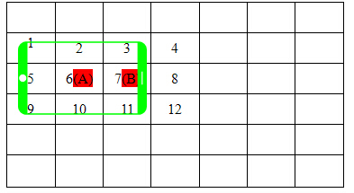

## 网络延迟

问题引入：

这里主要讨论状态同步，client A发生状态变化（移动，换装，属性变化等），将变化的信息同步到client B,最简单做法就是直接通过服务器中转然后广播出去，但是由于存在网络延迟，所以client B收到的消息总是滞后的，这对于高精度高技巧性的游戏的无法容忍的。

解决方式:

首先要实现网络对时操作，所谓对时，并不是要求客户端时间跟服务器保持一致，而是通过在数据包中加入时间戳，算出数据包的网络延迟时间。首先客户端向服务器发送一个消息包，里面带上客户端的本地时间t1,服务器收到数据包打上服务器本地时间t2，服务器在内部流转该数据包可能会有时间消耗（比如一些逻辑处理，校正等），在服务器广播该数据包的时候打上服务器本地时间t3，客户端收到服务器广播的数据包时打上客户端本地时间t4。这里我们假设数据上下行的网络延迟是一样的。那么通过计算(（t4-t1）-(t3-t2))/2, 就可以计算出单程一个网络包的大概延迟。


## 玩家移动状态同步

### 基于帧的状态同步

在开始设计的时候，没有考虑很多，为了简化操作，使用了基于帧的状态同步，在这种模式下，即当地图中玩家的状态发生改变，就立即往服务器发送一个状态数据包，然后通过服务器广播给当前地图中的所有玩家，其他的客户端收到该数据包后解析并设状态。这样的做的优势很明显，简单粗暴，同时状态信息准确。但是仔细分析之后，这样的做法增大了服务器的压力。

举个例子：在当前的游戏中，游戏的更新速率为 120 FPS，即一秒钟更新120次。如果玩家静止不动，则不需要发送数据包，但是如果玩家处于移动状态的时候，一秒钟会向服务器发送120个数据包，同时服务器需要广播（120*PlayerCount– 1）个数据包，

假设一个数据包的大小为10 bytes，一个地图有10个玩家（包括自己），那么服务器的带宽为12kbps ，十分消耗服务器性能。因此考虑在移动平台下，这种方式不可取。

###  基于预言的状态同步 

由于每一次移动或者改变状态都需要发送数据包，消耗服务器性能。通过观察官方设计，使用基于预言的状态同步。

实现前提：可接受的延迟（RPG类游戏可接受200ms左右的延迟）

官方设计：官方设计实际上实现的十分精巧，将一个 玩家/怪物 的移动拆分成了一个移动片段（MovementFragments），在每个片段中，包含了当前的位置，下一次的位置和时间。即

struct MovementFragments {

Int16_t x;

Int16_t y;

Int16_t nextX;

Int16_t nextY;

Int16_t duration;

}

在当前的客户端中，通过当前的位置（x,y），和当前的速度(speed)，产生一个随机的时间duration （duration ∈（0,510））,通过这些参数算出移动过后的位置：

nextX = x + speed * duration;

nextY = y + speed * duration;

当其他客户端收到该数据包之后，通过数据包的值，算出玩家的速度，同时移动。

OtherPlayer.moveToUntil(nextX,nextY,duration);

同时在官方的设计当中，一秒钟将一次状态改变拆分成了5次片段，片段的是消耗时间为一个随机值，但是总时间为510毫秒。因此在一次更新速度为120FPS的游戏当中，一秒钟只需要发送10个数据包，大大缓解了服务器的压力。

### 加上网络延迟的移动同步

这里参考了[云风的博客](https://blog.codingnow.com/2012/03/dev_note_12.html)以及其他一些的资料，把目前主流的同步策略在这里做下总结。

流程如下：

- 进入地图时做一次客户端和服务端的对时，以服务端为准，计算时间差，以后每隔一段时间（1分钟）对时一次。

- 客户端每隔一段时间（1秒），将当前运动状态（位置、速度、加速度）和时间戳T1同步到服务端。

- 服务端接到客户端同步后，立即推送给地图中的所有人的客户端。以下对于接收方是自己和其他人，两种情况分别讨论：
  1. 对于其他人，根据T1时刻的运动状态和当前本地时间T2，计算T2 + 1秒时刻的预测位置，反推当前的速度。
  2. 对于自己，根据T1时刻的运动状态和当前本地时间T2，计算当前时刻（T2）的预测位置，只要实际位置和预测位置相差不大，不用修正；否则直接移动到预测位置。

**对于这套策略的总结如下：**

- 以客户端的操作手感为先，服务端只做校验，防止作弊。这样对于自己来说，操作体验和单机无异；对于地图上显示的其他玩家，位置还原的精准程度取决于上述步骤2中同步的频率，理论上，频率越高则越精准，不过也会带来更高的网络和服务器开销，同时也要考虑游戏类型的实际需求，各方面因素综合考虑。

- 为了减小网络延迟的影响，采用对时和预测补偿的做法。对时是在进入地图的时候做一次，以后每隔1分钟再做一次，以防本地时间跳变带来的影响。预测补偿很重要，对于其他人的运动，我们总是预测1秒后的位置，再反推当前速度，为的是平滑处理，避免出现跳变。

- 保持一定的同步频率，还有一个好处是保持网络流量稳定，避免玩家在频繁操作时大量发包。例如，在带摇杆的游戏里玩家有可能会旋转摇杆在原地转圈，其实这种情况下其他玩家不用关心到那么细，只用保持一定采样频率即可。另外，就算客户端需要加入物理引擎也很方便，服务端不用做强验证，只要防止穿越地图这样的明显作弊即可。

基本思路就是这些。当然这些都是理论设想，最终效果还需要在实践中检验，也有可能部分策略需要做补充和微调，部分参数如采样频率和预测时间都需要在项目中调校，为了最终实现效果和性能的平衡。


## 怪物状态同步

在一个地图当中，玩家的状态同步之后，则需要同步地图中怪物的位置信息，怪物的位置信息同步方式一般有两种实现方式

### 基于客户端的状态同步

一个地图中的怪物状态，实际上是由地图中玩家所决定的，当玩家施加攻击、使用技能，都会改变怪物的状态。在MapleStroy的设计当中，怪物的位置计算是属于离线计算，这也就是说，服务器不参与怪物的状态，这样的好处是节约流量、减缓服务器压力，但是坏处是，会出现怪物静止、吸怪等外挂手段。在移植MapleStroy的过程中，为了同步官方和考虑移动平台流量问题，因此采用此种手段。

实现策略：

怪物的位置由第一个进入该地图的玩家决定。这也就是说，当第一个玩家进入该地图之后，控制着当前地图中所有怪物的移动状态。当第二个玩家进入该地图之后，第一个玩家会广播当前所有怪物的状态，第二个玩家根据这些数据包进行改变。当然其他玩家发生了攻击，或者激怒怪物的操作后，也会广播这个消息。

同时怪物的移动也是采用基于预言的状态同步，大体实现和玩家移动相似。

 　怪物的同步在传统的端游里，是完全由服务器的怪物AI系统触发，客户端只是纯粹的接受服务器下发的怪物状态数据。对于手机游戏里，由于手机上很难出现像PC里那样的外挂，所以怪物的AI可以考虑放在客户端触发，同时减少怪物的状态同步。详细说明如下：

a) 怪物的随机移动不同步
　　在地图上，怪物都会有一个固定的位置。怪物没有进入战斗状态时，就会在这个固定位置的周围走来走去，随机的移动。这个随机的移动设定由每个客户端自己控制，这样怪物的随机移动，就不用消息广播进行同步了。

　　由于客户端自己控制怪物的随机走动，所以会出现不同客户端里，怪物位置不一样的问题。但由于怪物随机移动的范围较小，所以这个问题不是很明显，在手机上是可以接受的。角色打怪时，是扇形的伤害范围，所以即使怪物坐标在不同的客户端有点不一致，打怪的效果也可以接受。

b) 怪物的行为同步
　　当有角色攻击被动怪物，或者进入主动怪物的视野范围内时，怪物的AI就被这个角色所在的客户端锁定了，同时怪物进入攻击状态。攻击的判断完全由锁定怪物AI的客户端进行处理，同时这个客户端会将这个怪物的行为上发到服务器，由服务器广播给周围的其他玩家。

　　怪物的AI锁定，使用抢占式，即谁最先发消息给服务器申请怪物的AI锁定，谁就获得了怪物的控制权，直到怪物死亡或脱离战斗状态。

　　怪物可以每进行一次攻击，客户端就发一个消息给服务器。这样做，消息还是有点多，特别是一群怪围着几个角色进行攻击时，消息广播还是有点多。所以可以将状态的概念向上扩大，只同步怪物在攻击哪个玩家，而不同步每一次的攻击，然后由每个客户端根据怪物固定的攻击速度各自去表现。这样一个怪去攻击一个玩家，就只会有一次消息广播了。

c) 精英怪和BOSS怪的AI
　　精英怪和BOSS怪由于数量较少，而且比较重要，所以不能由客户端来申请AI控制权，而是服务器根据某种策略来控制。所使用的策略可以考虑角色的伤害值、防御值、角色与BOSS的距离远近等，根据这些因素，服务器计算出BOSS怪当前最适合攻击的对象（比如血量最少的玩家，最脆弱的法师等），然后将AI控制权发给那个客户端，由那个客户端控制攻击行为，同时通过消息让服务器同步给其他玩家。

　　总结：怪物的同步方式的选择，就是尽量减少消息的广播，同时让游戏效果在可接受的范围内。怪物AI的这个处理方式，实际上是同时省去了游戏服务器的怪物AI模块（端游一般是专门用的一个进程或者另外一台物理服务器来进行怪物AI的计算），从而简化了MMO游戏的开发难度，同时保证了较好的游戏体验。 


###  基于服务器的状态同步

服务器的状态同步原理很简单，服务器保存并控制着怪物的状态，因此当一个地图中有多个玩家的时候，广播当前的状态即可。


## 大地图同步(aoi)

问题引入：aoi(area of interest).在大地图中，玩家只需要关心自己周围的对象变化，而不需要关心距离较远的对象的变化。所以大地图中的数据不需要全部广播，只要同步玩家自己视野范围的消息即可。

解决方案：

1：灯塔法。

所谓灯塔法，即将大地图划分成有限的小格子，在每个小格子中间放一个灯塔，这个灯塔管理两个队列：一个是本格子内所有的对象集合，另一个是对本灯塔感兴趣的对象集合（简称观察者）。

而地图上的每个对象，维护一个视野队列：该队列为其视野范围内的所有对象，即自身感兴趣的所有对象。

一个对象在地图上面运动：分为三个操作：enter，move，leave.

enter:当对象进入地图的时候，根据对象的当前位置和对象的感知距离，可以获取到该对象能观察到的所有灯塔，遍历这些灯塔，将该对象添加为其观察者。同时将这些对象添加到自己的视野队列中。

move:当对象开始移动的时候，对象从一个点到另一个店，那么视野范围必然发生变化。此刻需要将对象从老的灯塔的观察者列表移除，同时将对象添加进新的灯塔的观察者列表。此外，还需要跟新玩家的视野队列，因为视野范围变化，视野内的对象也相应变化。

leave:当对象离开的时候，将自身从附近灯塔的观察者队列中移除。

通过灯塔法，每当物体发生变化，我们能马上根据其当前位置，定位到他的所在的灯塔，同时找到它视野范围内相关联的物体。这样避免了遍历地图上所有玩家进行处理的方式。

当然灯塔的格子大小划分要因地制宜，格子越小，消耗内存越大，同时计算量变大。

-  https://github.com/Bestpoker/AOI 

2: 九宫格

九宫格也是打格子的方式之一，把地图划分为很多小格子，每个格子记录格子内的玩家，每个玩家的aoi范围是以自己为中心范围内的九个格子，九个格子的大小略大于屏幕大小，同样的有三个主要的操作：enter,move,leave

enter:根据玩家坐标，加入到所属的格子中，通过计算以这个格子的为中心的九个格子，这九个格子内的玩家就要被通知有新玩家初始化，同时这个新玩家初始化九个格子内的所有玩家。

move:根据移动前位置的格子，计算出移动前的oldaoi集合，根据当前位置的格子，计算出当前的curaoi集合，如果oldaoi, curaoi为同一个格子，则通知格子内的所有玩家该玩家在移动。如果oldaoi,curaoi不是同一个格子，即发生了跨格子的操作，那么要将该玩家从旧格子移除，同时加入新格子。同时分别遍历oldaoi,curaoi,计算出需要通知玩家消失的格子集合，通知玩家出生的格子集合，以及通知玩家移动的格子集合。

leave:玩家离开地图，将玩家从对应的格子里面删除，同时通知aoi集合有玩家离开。


 服务器大格子的大小，以3*3的格子要总比客户端显示范围要大一点为原则。比客户端大一点，是为了预留资源加载的时间。
　　如下图所示，绿色表示手机客户端的显示区域，当角色A在格子6中时，他可以看到1,2,3,5,6,7,9,10,11这9个格子里的内容，那么当他的状态发生变化时，就需要同步给在这9个格子里的所有玩家；同样，当这9个格子里的有玩家或者怪物的状态改变时，也需要都同步给角色A。



　　当角色A移动到角色B所在的格子(7)，则他将不再看到1,5,9这三个格子里的内容，同时他将新看到4,8,12这三个格子里的地图内容（玩家和怪物）。所以这个过程中，服务器要下发消息，删除角色A所在的客户端里的1,5,9这三个格子里的地图内容，同时下发消息新增4,8,12这三个格子里的地图内容（类型一）。
　　推荐大格子具体的大小，按客户端iPhone4S的960*640分辨来制定，取屏幕长宽的1/2大一些，可以定为640*360。 

-  https://github.com/artasccope/GameFW.AOI 

3：十字链表法

这里以2d游戏为例，3d游戏顺势扩展即可。

所谓十字链表法，即维护两天链表，一条根据地图上所有物体的x坐标从小到大依次插入链表，一条根据地图上所有物体的y坐标从小到大依次插入链表，可以想象成一个十字架。这样便把地图上的所有对象按序分配到了x,y链表上。

这里的链表为双向链表，双向链表的好处是，获取到链表中的一个节点，便可以向前和向后遍历。这样，当我们拿到一个对象时，要获取该对象的视野范围就变得非常简单。避免了从头到尾遍历所有对象。

首先根据x坐标，在x链表上找到该节点，然后从该节点向前和向后遍历，根据x方向的视野范围找出需要识别的对象。

然后根据y坐标，在y链表上找到该节点，然后从该节点向前和向后遍历，根据y方向的视野范围找出需要识别的对象。

拿到x,y链表上需要关注的对象，然后取他们的交集，这便是玩家视野范围内的对象。

对于对象在地图上的enter,move,leave 。根据前面的思路就变得非常简单

-  https://github.com/zhepama/AOI 

### **十字链表基本原理**

根据二维地图，将其分成x轴和y轴两个链表。如果是三维地图，则还需要维护多一个z轴的链表。将对象的坐标值按照从小到大相应的排列在相应的坐标轴上面。

- 添加到AOI（ADD）: 根据新增对象的X,Y坐标,依次遍历X,Y轴坐标链表,这里有两个目的,一个是获得这个新增对象的坐标在X,Y轴坐标的位置,另一方面获得该通知哪些结点.通知的范围,每个对象可以自己定制自己的通知范围。必须X,Y坐标同时都在通知范围内才可以进入通知集合，我们要按照从小到大进行插入。例如X轴坐标为:

a->b->c->d->e->f->g->h

假设新增一个对象z,它最终所在的位置是c和d之间,需要重新在链表的头部开始遍历寻找z的位置，比如z的X轴位置是5：

a(0)->b(1)->c(2)->d(3)->e(4)-z(5)->f(6)->g(7)->h(8)

但是这样会发现一个问题，如果需要管理的坐标少还可以。但如果有很多个坐标比如1W个坐标，那这个链表会很长，如果每次都需要从头部开始查找效率就很低。针对这样的插入方法目前大家常用的有快速排序、分治、按区域划分格子等方式。

### **目前常用的排序算法**

- 快速排序（Quicksort）是对[冒泡排序](https://link.zhihu.com/?target=https%3A//baike.baidu.com/item/%E5%86%92%E6%B3%A1%E6%8E%92%E5%BA%8F/4602306)的一种改进。

快速排序由C. A. R. Hoare在1962年提出。它的基本思想是：通过一趟排序将要排序的数据分割成独立的两部分，其中一部分的所有数据都比另外一部分的所有数据都要小，然后再按此方法对这两部分数据分别进行快速排序，整个排序过程可以[递归](https://link.zhihu.com/?target=https%3A//baike.baidu.com/item/%E9%80%92%E5%BD%92/1740695)进行，以此达到整个数据变成有序[序列](https://link.zhihu.com/?target=https%3A//baike.baidu.com/item/%E5%BA%8F%E5%88%97/1302588)。

- 分治算法

分治算法的基本思想是将一个规模为N的问题分解为K个规模较小的子问题，这些子问题相互独立且与原问题性质相同。求出子问题的解，就可得到原问题的解。即一种分目标完成程序算法，简单问题可用二分法完成。

- 按区域划分格子

该方法是把区域划分成多个格子，比如X坐标1到X坐标4为一个格子我们（暂时称之为A格子），坐标5到X坐标9为一个格子（暂时称之为B格子）。这样做的好处是，当你插入的坐标是2的时候，我们只需要遍历A格子里面的数据找到自己位置就可以了。

综合以上三种方法，大家一眼就看出来了。是的，按区域划分格子的方式是目前最佳的方式。从时间复杂度等等所有方便都是这个最佳，但是这个方法也有一个很大的问题，用这样的方式插入是很快了，但查找范围内的坐标就变的很困难了。大家可以仔细考虑一下或者自己写一个DEMO。你马上会发现，当我知道我的位置的情况下，我该如何查找周围玩家呢，是的。这样的话十字链就没有什么用了。

当然会有人说我在每个格子之间用链表进行连接就可以了，那么问题又来了。该如何连接，肯定有很复杂的代码才可以完成这样逻辑。就算是你能完成这个链表的连接，但这些逻辑会提升了时间复杂度。

### **个人认为最佳解决方案（快慢针）：**

所谓快慢针就是，总有一个指针快于一个指针。

实现方式是，插入的时候把链表分成多份、比如链表长度为10，快的指针每次移动4个，然后对比当前节点如果位置小于的话，把慢指针指向快指针的位置，快指针继续向后面4个格子移动，直到找到大于的节点为止，这时候慢指针开始向前移动一个一个的对比位置就可以了。如果一直没有找到大于的节点，那就表示要插入的位置是当前链表最后的位置。

相信大家已经看明白了，是的。这样的情况下效率就很高了，唯一的问题就是这个时间复杂度不稳定。使用这个方式，查找周围玩家直接前后查找移动就可以了。效率也非常高。

快慢针实现：

```text
if (First == null)
{
      node.Link.YNode = AddFirst(AoiPool.Instance.Fetch<LinkedListNode<AoiNode>>(node).Value);
}
else
{
       var slowCursor = First;

       var skip = Convert.ToInt32(Math.Ceiling(Convert.ToDouble(Count) /
                     Convert.ToDouble(_skipCount)));

       if (Last.Value.Position.Y > node.Position.Y)
       {
            for (var i = 0; i < _skipCount; i++)
            {
                 // 移动快指针

                 var fastCursor = FastCursor(i * skip, skip);

                 // 如果快指针的值小于插入的值，把快指针赋给慢指针，当做当前指针。

                 if (fastCursor.Value.Position.Y <= node.Position.Y)
                 {
                       slowCursor = fastCursor;

                            continue;
                 }

                 // 慢指针移动到快指针位置

                 while (slowCursor != fastCursor)
                 {
                      if (slowCursor == null) break;

                      if (slowCursor.Value.Position.Y >= node.Position.Y)
                      {
                           node.Link.YNode = AddBefore(slowCursor,
                                    AoiPool.Instance.Fetch<LinkedListNode<AoiNode>>(node).Value);

                           return;
                        }

                       slowCursor = slowCursor.Next;

                        }
                    }
                }

if (node.Link.YNode == null)
{
       node.Link.YNode = AddLast(AoiPool.Instance.Fetch<LinkedListNode<AoiNode>>(node).Value);
}
```

### **实现方式**

- Move（当角色移动后通知AOI）：

```text
#region 移动X轴

            if (Math.Abs(node.Position.X - x) > 0)
            {
                if (x > node.Position.X)
                {
                    var cur = node.Link.XNode.Next;

                    while (cur != null)
                    {
                        if (x < cur.Value.Position.X)
                        {
                            _xLinks.Remove(node.Link.XNode);

                            node.Position.X = x;
                            
                            node.Link.XNode = _xLinks.AddBefore(cur, node);

                            break;
                        }
                        else if (cur.Next == null)
                        {
                            _xLinks.Remove(node.Link.XNode);
                            
                            node.Position.X = x;
                            
                            node.Link.XNode = _xLinks.AddAfter(cur, node);

                            break;
                        }

                        cur = cur.Next;
                    }
                }
                else
                {
                    var cur = node.Link.XNode.Previous;

                    while (cur != null)
                    {
                        if (x > cur.Value.Position.X)
                        {
                            _xLinks.Remove(node.Link.XNode);
                            
                            node.Position.X = x;
                            
                            node.Link.XNode = _xLinks.AddBefore(cur, node);

                            break;
                        }
                        else if (cur.Previous == null)
                        {
                            _xLinks.Remove(node.Link.XNode);
                            
                            node.Position.X = x;
                            
                            node.Link.XNode = _xLinks.AddAfter(cur, node);

                            break;
                        }

                        cur = cur.Previous;
                    }
                }
            }

            #endregion

            #region 移动Y轴

            if (Math.Abs(node.Position.Y - y) > 0)
            {
                if (y > node.Position.Y)
                {
                    var cur = node.Link.YNode.Next;

                    while (cur != null)
                    {
                        if (y < cur.Value.Position.Y)
                        {
                            _yLinks.Remove(node.Link.YNode);
                            
                            node.Position.Y = y;
                            
                            node.Link.YNode = _yLinks.AddBefore(cur, node);

                            break;
                        }
                        else if (cur.Next == null)
                        {
                            _yLinks.Remove(node.Link.YNode);
                            
                            node.Position.Y = y;
                            
                            node.Link.YNode = _yLinks.AddAfter(cur, node);

                            break;
                        }

                        cur = cur.Next;
                    }
                }
                else
                {
                    var cur = node.Link.YNode.Previous;

                    while (cur != null)
                    {
                        if (y > cur.Value.Position.Y)
                        {
                            _yLinks.Remove(node.Link.YNode);
                            
                            node.Position.Y = y;
                            
                            node.Link.YNode = _yLinks.AddBefore(cur, node);

                            break;
                        }
                        else if (cur.Previous == null)
                        {
                            _yLinks.Remove(node.Link.YNode);
                            
                            node.Position.Y = y;
                            
                            node.Link.YNode = _yLinks.AddAfter(cur, node);

                            break;
                        }

                        cur = cur.Previous;
                    }
                }
            }

            
            #end-region
```

- 查找周围（按照指定的范围查找自己周围玩家）：

```text
for (var i = 0; i < 2; i++)
            {
                var cur = i == 0 ? node.Link.XNode.Next : node.Link.XNode.Previous;

                while (cur != null)
                {
                    if (Math.Abs(Math.Abs(cur.Value.Position.X) - Math.Abs(node.Position.X)) > area.X)
                    {
                        break;
                    }
                    else if (Math.Abs(Math.Abs(cur.Value.Position.Y) - Math.Abs(node.Position.Y)) <= area.Y)
                    {
                        if (Distance(node.Position, cur.Value.Position) <= area.X)
                        {
                            if (!node.AoiInfo.MovesSet.Contains(cur.Value.Id)) node.AoiInfo.MovesSet.Add(cur.Value.Id);
                        }
                    }

                    cur = i == 0 ? cur.Next : cur.Previous;
                }
            }

            for (var i = 0; i < 2; i++)
            {
               var cur = i == 0 ? node.Link.YNode.Next : node.Link.YNode.Previous;

                while (cur != null)
                {
                    if (Math.Abs(Math.Abs(cur.Value.Position.Y) - Math.Abs(node.Position.Y)) > area.Y)
                    {
                        break;
                    }
                    else if (Math.Abs(Math.Abs(cur.Value.Position.X) - Math.Abs(node.Position.X)) <= area.X)
                    {
                        if (Distance(node.Position, cur.Value.Position) <= area.Y)
                        {
                            if (!node.AoiInfo.MovesSet.Contains(cur.Value.Id)) node.AoiInfo.MovesSet.Add(cur.Value.Id);
                        }
                    }

                    cur = i == 0 ? cur.Next :cur.Previous;
                }
            }
```

