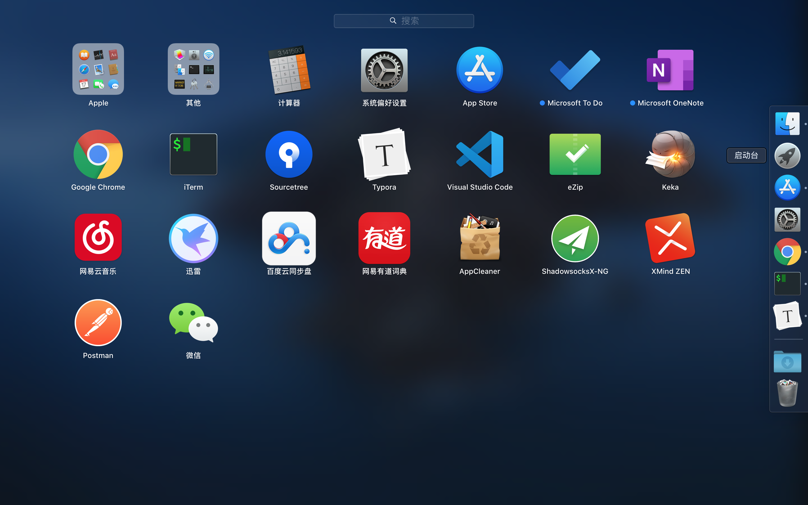

---
title:"brew 使用"
---


Command-R 重新安装您在 Mac 上安装过的最新 macOS，但不会升级到更高的版本。1

Option-Command-R 升级到与您的 Mac 兼容的最新 macOS。2

Shift-Option-Command-R 需要安装 [macOS Sierra 10.12.4](https://link.zhihu.com/?target=https%3A//support.apple.com/zh-cn/HT201260) 或更高版本重新安装 Mac 随附的 macOS 或仍有提供的最接近版本。


```obj
csrutil disable
```

```
vi /etc/fstab
UUID=BA245166-9FB3-4D88-98E3-147559D0B531 /usr/local apfs rw,auto,nobrowse
```

