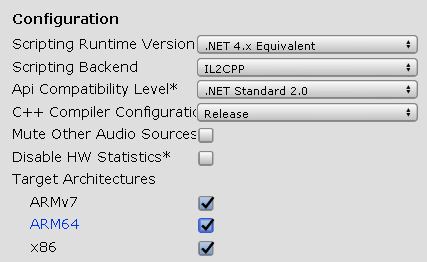
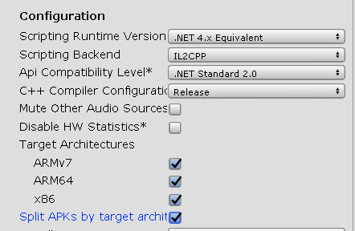
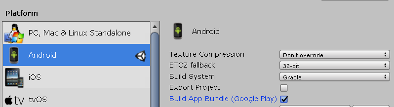

Unity supports x64 since 2017 LTS. To enable it you can go to File > Build Settings > Player Settings.

There under "Other Settings" you have to change your Script Backend to IL2CPP, and you will have the ARM64 checkbox active. Check it.

And then you can either select to generate Split APKs by Target Architecture

or in your Build Settings dialog choose to Build App Bundle (Google Play)

Hope it helps, you will need to have the Android NDK for this.

