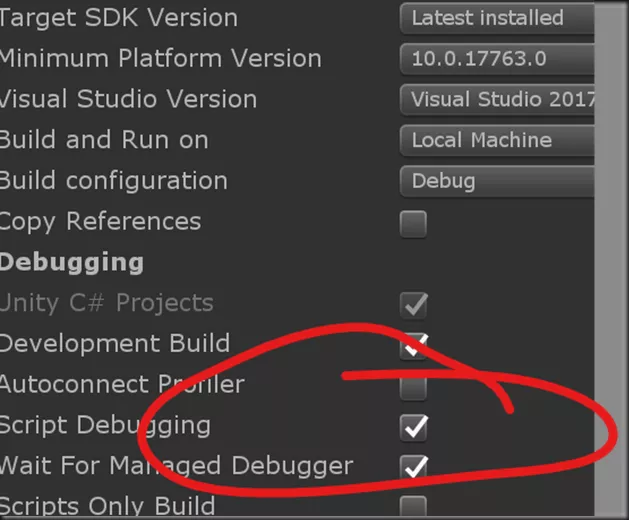
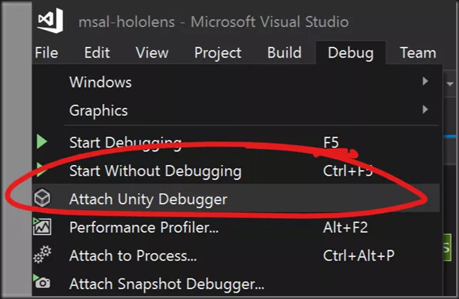

# iOS IL2CPP打包注意事项

鉴于IL2CPP的特殊性，实际在iOS的发布中可能会遇到一些问题，在这里给大家介绍几个iOS发布时可能会遇到的问题。

IL2CPP和mono的最大区别就是不能在运行时动态生成代码和类型，所以这就要求必须在编译时就完全确定需要用到的类型。

## 注意事项

- il2cpp  没有使用的字段都不会被编译..
- json反序列化的时候get,set不能被使用
- 不要用dynamic关键字

类型裁剪
--------
IL2CPP在打包时会自动对Unity工程的DLL进行裁剪，将代码中没有引用到的类型裁剪掉，以达到减小发布后ipa包的尺寸的目的。然而在实际使用过程中，很多类型有可能会被意外剪裁掉，造成运行时抛出找不到某个类型的异常。特别是通过反射等方式在编译时无法得知的函数调用，在运行时都很有可能遇到问题。

Unity提供了一个方式来告诉Unity引擎，哪些类型是不能够被剪裁掉的。具体做法就是在Unity工程的Assets目录中建立一个叫link.xml的XML文件，然后按照下面的格式指定你需要保留的类型：
```XML
<linker>
  <assembly fullname="UnityEngine" preserve="all"/>
  <assembly fullname="Assembly-CSharp">
    <namespace fullname="MyGame.Utils" preserve="all"/>
    <type fullname="MyGame.SomeClass" preserve="all"/>
  </assembly>  
</linker>
```

泛型实例
---------
每个泛型实例实际上都是一个独立的类型，`List<A>` 和 `List<B>`是两个完全没有关系的类型，这意味着，如果在运行时无法通过JIT来创建新类型的话，代码中没有直接使用过的泛型实例都会在运行时出现问题。

在ILRuntime中解决这个问题有两种方式，一个是使用CLR绑定，把用到的泛型实例都进行CLR绑定。另外一个方式是在Unity主工程中，建立一个类，然后在里面定义用到的那些泛型实例的public变量。这两种方式都可以告诉IL2CPP保留这个类型的代码供运行中使用。

因此建议大家在实际开发中，尽量使用热更DLL内部的类作为泛型参数，因为DLL内部的类型都是ILTypeInstance，只需处理一个就行了。此外如果泛型模版类就是在DLL里定义的的话，那就完全不需要进行任何处理。

## IL2CPP限制

将游戏导出到 iOS 等平台时，Unity 将使用其 IL2CPP 引擎将 IL“转换”为 C++ 代码，然后使用目标平台的本机编译器进行编译。 在此方案中，有几个不支持的 .NET 功能，例如反射的部分内容和使用 `dynamic` 关键字。 虽然可在自己的代码中使用这些功能，但使用第三方 DLL 和 SDK 时可能会遇到问题，这些 DLL 和 SDK 并非使用 Unity 和 IL2CPP 编写。 有关此主题的详细信息，请参阅 Unity 站点上的[脚本限制](https://docs.unity3d.com/Manual/ScriptingRestrictions.html)文档。

此外，如之前 Json.NET 示例中所述，Unity 将尝试在 IL2CPP 导出过程中裁剪掉未使用的代码。 虽然这通常不是问题，但对于使用反射的库，它可能会意外地删除在导出时无法确定是否被调用而在运行时可能被调用的属性或方法。 若要解决这些问题，请添加一个 link.xml 文件到项目中，该文件中包含的程序集和命名空间列表不会执行裁剪过程。 有关完整详细信息，请参阅[有关字节码裁剪的 Unity 文档](https://docs.unity3d.com/Manual/IL2CPP-BytecodeStripping.html)。

## 编译速度优化

1. 增量编译
2. 关闭实时保护
3. 使用ssd

## 相关链接

- https://docs.microsoft.com/en-us/visualstudio/cross-platform/unity-scripting-upgrade?view=vs-2019
- https://docs.unity3d.com/Manual/IL2CPP-OptimizingBuildTimes.html
- https://docs.unity3d.com/Manual/IL2CPP-BytecodeStripping.html
- https://docs.unity3d.com/Manual/ScriptingRestrictions.html


# 关于如何进行unity远程debugger

- 首先打开unity的debug模式




- 开启visual sudio中找到attach unity debugger




