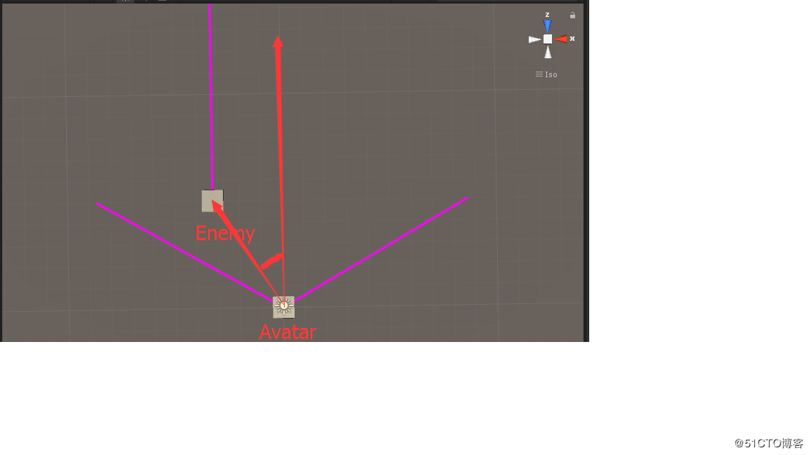
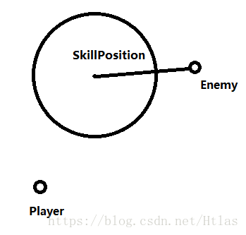

---
title:"unity攻击范围检测"
---


# 扇形攻击

其实这个分为两部分，

- 是在扇形距离范围内（也就是不考虑角度，其实是圆形范围内）Vector3.Distance(a, b);计算距离

- 是扇形角度范围内

计算怪物是否在你的视野范围内其实可以这么看


Avatar的正方向向量与Avatar到Enemy之间向量的夹角大小是否小于于视线大小的一半。

这样就能判断是否在视线范围内。

所以现在的问题就是这么计算这个夹角

计算的方式是，

1. 获取Avatar正方向的一个点与Avatar世界坐标相减，获取正方向向量

2. Enemy的世界坐标与Avatar世界坐标相减，获取Enemy到Avatar的方向向量

3. 调用Vector3.Angle(a, b)计算夹角

```c#
    public GameObject avatar;
    public GameObject enemy;
    
	//扇形距离 攻击距离  扇形的半径 
    float minDistance = 10f;
    //扇形的角度 也就是攻击的角度
    float minAngle = 120f;

    // Update is called once per frame
    void Update ()
    {
        Vector3 avatarPos = avatar.transform.position;
        Vector3 enemyPos = enemy.transform.position;
        
        //与敌人的距离
        float distance = Vector3.Distance(avatarPos, enemyPos);

        //主角相对于目标的向量
        Vector3 srcLocalVect = enemyPos - avatarPos;
        srcLocalVect.y = 0;

        //获取主角正前方的一个点
        Vector3 forwardLocalPos = avatar.transform.forward * 1 + avatarPos;

        //获取正方向向量
        Vector3 forwardLocalVect = forwardLocalPos - avatarPos;
        forwardLocalVect.y = 0;

        //计算角度
        float angle = Vector3.Angle(srcLocalVect, forwardLocalVect);

        if(distance < minDistance && angle < minAngle/2)
        {
            Debug.Log("In EyeSight");
        }
    }
```


# 长方形范围攻击检测

```c#
using UnityEngine;
using System.Collections;


public class AttackCHeck : MonoBehaviour
{
    //要攻击的目标
    public Transform Target;

    private void Update()
    {
        //计算玩家与敌人的距离
        float distance = Vector3.Distance(transform.position, Target.position);
        //玩家与敌人的方向向量
        Vector3 temVec = Target.position - transform.position;
        //与玩家正前方做点积
        float forwardDistance = Vector3.Dot(temVec, transform.forward.normalized);
        if (forwardDistance > 0 && forwardDistance <= 10)
        {
            float rightDistance = Vector3.Dot(temVec, transform.right.normalized);

            if (Mathf.Abs(rightDistance) <= 3)
            {
                Debug.Log("进入攻击范围");
            }
        }

    }
}
```

# 判断目标点是否在指定的矩形内（两个随机点确定的矩形）

```

public class Rectangle01
{
    /// Min为当前坐标系中矩形的最小点
    /// Max为当前坐标系中矩形的最大点
    public Vector2 Min;
    public Vector2 Max;
 
    public bool Contains( Vector2 point)
    {
        if (point.x < this.Min.x)
        {
            return false;
        }
        if (point.x > this.Max.x)
        {
            return false;
        }
        if (point.y < this.Min.y)
        {
            return false;
        }
        if (point.y > this.Max.y)
        {
            return false;
        }
        return true;
    }
 
    public void CalcVertices(out Vector2 vertex0, out Vector2 vertex1, out Vector2 vertex2, out Vector2 vertex3)
    {
        vertex0 = this.Min;
        vertex1 = new Vector2(this.Max.x, this.Min.y);
        vertex2 = this.Max;
        vertex3 = new Vector2(this.Min.x, this.Max.y);
    }
}
```

测试   脚本

```
public class TestRt01 : MonoBehaviour {
 
    public Transform Point;
    public Transform RtPoint0, RtPoint1;
    public Rectangle01 rtBox;
 
    private const float _pointRadius = 0.1f;
  
    private void OnDrawGizmos()
    {
        if (rtBox != null)
        {
            DrawRt(rtBox);
            Gizmos.DrawSphere(Point.position, _pointRadius);
        }
    }
    private void Update()
    {
        if (Input.GetKeyDown(KeyCode.Q))
        {
            rtBox = CreateFromTwoPoints(RtPoint0.position, RtPoint1.position);
            bool cont = rtBox.Contains(Point.position);
            if (cont)
            {
                Debug.Log("目标点在矩形范围内");
            }
            else
            {
                Debug.Log("目标点不在矩形范围内");
            }
        }
    }
    public Rectangle01 CreateFromTwoPoints(Vector2 point0, Vector2 point1)
    {
        Rectangle01 rt = new Rectangle01();
        if (point0.x < point1.x)
        {
            rt.Min.x = point0.x;
            rt.Max.x = point1.x;
        }
        else
        {
            rt.Min.x = point1.x;
            rt.Max.x = point0.x;
        }
        if (point0.y < point1.y)
        {
            rt.Min.y = point0.y;
            rt.Max.y = point1.y;
        }
        else
        {
            rt.Min.y = point1.y;
            rt.Max.y = point0.y;
        }
        return rt;
    }
 
    protected void DrawRt( Rectangle01 box)
    {
        Vector2 v0, v1, v2, v3;
        box.CalcVertices(out v0, out v1, out v2, out v3);
        Gizmos.color = Color.blue;
        Gizmos.DrawLine(v0, v1);
        Gizmos.DrawLine(v1, v2);
        Gizmos.DrawLine(v2, v3);
        Gizmos.DrawLine(v3, v0);
    }
}
```

# 判断目标点是否在某一矩形区域（以任一点为中心的矩形区域）

```
public class Box {
 
    public Vector2 Center;
    public Vector2 Axis0;
    public Vector2 Axis1;
    public Vector2 Extents;
 
    public Box(Vector2 center, Vector2 axis0, Vector2 axis1, Vector2 extents)
    {
        this.Center = center;
        this.Axis0 = axis0;
        this.Axis1 = axis1;
        this.Extents = extents;
    }
    public bool Contains(Vector2 point)
    {
        Vector2 vector;
        vector.x = point.x - this.Center.x;
        vector.y = point.y - this.Center.y;
        float num = vector.Dot(ref this.Axis0);
        if (num < -this.Extents.x)
        {
            return false;
        }
        if (num > this.Extents.x)
        {
            return false;
        }
        num = vector.Dot(ref this.Axis1);
        if (num < -this.Extents.y)
        {
            return false;
        }
        if (num > this.Extents.y)
        {
            return false;
        }
        return true;
    }
 
    public void CalcVertices(out Vector2 vertex0, out Vector2 vertex1, out Vector2 vertex2, out Vector2 vertex3)
    {
        Vector2 vector = (Vector2)(this.Axis0 * this.Extents.x);
        Vector2 vector2 = (Vector2)(this.Axis1 * this.Extents.y);
        vertex0 = (this.Center - vector) - vector2;
        vertex1 = (this.Center + vector) - vector2;
        vertex2 = (this.Center + vector) + vector2;
        vertex3 = (this.Center - vector) + vector2;
    }
 
}
 
public static class Vector2ex
{
    public static float Dot(this Vector2 vector, ref Vector2 value)
    {
        return ((vector.x * value.x) + (vector.y * value.y));
    }
}

```

测试脚本

```

public class TestBox : MonoBehaviour {
 
    public Transform Point;
    public Transform rtBox;
    Box box;
    private const float _pointRadius = .11f;
    private void OnDrawGizmos()
    {
        if (box!=null)
        {
            Gizmos.DrawSphere(Point.position, _pointRadius);
            DrawBox(ref box);
        }
    }
    private void Update()
    {
        if (Input.GetKeyDown(KeyCode.Q))
        {
            box = new Box(rtBox.position, rtBox.right, rtBox.up, rtBox.localScale); ;
            bool cont = box.Contains(Point.position);
            if (cont)
            {
                Debug.Log("目标点在矩形范围内");
            }
            else
            {
                Debug.Log("目标点不在矩形范围内");
            }
        }
    }
 
    protected void DrawBox(ref Box box)
    {
        Vector2 v0, v1, v2, v3;
 
        box.CalcVertices(out v0, out v1, out v2, out v3);
        Gizmos.color = Color.blue;
        Gizmos.DrawLine(v0, v1);
        Gizmos.DrawLine(v1, v2);
        Gizmos.DrawLine(v2, v3);
        Gizmos.DrawLine(v3, v0);
    }
}
```


# 半圆形攻击范围检测

```
using UnityEngine;
using System.Collections;


public class AttackCHeck : MonoBehaviour
{
    //要攻击的目标
    public Transform Target;
    private void Update()
    {
        //计算玩家与敌人的距离
        float distance = Vector3.Distance(transform.position, Target.position);
        //玩家与敌人的方向向量
        Vector3 temVec = Target.position - transform.position;
        //与玩家正前方做点积
        float forwardDistance = Vector3.Dot(temVec, transform.forward.normalized);
        if (forwardDistance > 0 && forwardDistance <= 10)
        {
            if (distance <= 5)
            {
                Debug.Log("进入攻击范围");
            }
        }
    }
}
```


# 圆形攻击范围

圆形攻击范围有两种，以玩着荣耀的王昭君大招为例子，

第一种是制定位置施法：新版本的王昭君的大招是指定位置施法的，也就是说在玩家固定施法半径以内可随意放一个圆形的技能。在半径之内的敌人受伤。

第二种是固定位置施法：老版本的王昭君大招是在自身一定半径以内，敌人在这个范围内受伤。

其实两种判断都很简单，只需要判断敌人和SkillPosition之间的距离是否小于半径即可。



```
/// <summary>
    /// 不定点式圆形攻击
    /// </summary>
    /// <param name="attacked">被攻击方</param>
    /// <param name="skillPosition">技能释放位置</param>
    /// <param name="radius">半径</param>
    /// <returns></returns>
    public bool CircleAttack(Transform attacked,Transform skillPosition, float radius)
    {
        float distance = Vector3.Distance(attacked.position, skillPosition.position);
        if (distance < radius)
        {
            return true;
        }
        return false;
	}
```

方法2

```
public class Circle {
 
    public Vector2 Center;
    public float Radius;
 
    public Circle(Vector2 center, float radius)
    {
        this.Center = center;
        this.Radius = radius;
    }
 
    public bool Contains( Vector2 point)
    {
        Vector2 vector = point - this.Center;
        return (vector.SqrMagnitude() <= (this.Radius * this.Radius));
    }
 
    public Vector2 Eval(float t)
    {
        return new Vector2(this.Center.x + (this.Radius * Mathf.Cos(t)), this.Center.y + (this.Radius * Mathf.Sin(t)));
    }
 }
```


# 判断一个点是否在三角形里面

```
public static  bool InTrigon(Vector3 _target,Vector3 _center,Vector3 _left,Vector3 _right){  
        Vector3 Ctl=_left-_center;  
        Vector3 Ctr=_right -_center;  
        Vector3 Ctt=_target-_center;  
        Vector3 Ltr=_right-_left;  
        Vector3 Ltc=_right-_center;  
        Vector3 Ltt=_left-_target;  
        Vector3 Rtl=_left-_right;  
        Vector3 Rtc=_center-_right;  
        Vector3 Rtt=_target-_right;  
        if(   
           Vector3.Dot(Vector3.Cross(Ctl,Ctr).normalized,Vector3.Cross(Ctl,Ctt).normalized)==1&&  
           Vector3.Dot(Vector3.Cross(Ltr,Ltc).normalized,Vector3.Cross(Ltr,Ltt).normalized)==1&&  
           Vector3.Dot(Vector3.Cross(Rtc,Rtl).normalized,Vector3.Cross(Rtc,Rtt).normalized)==1  
           )  
            return true;  
        else  
            return false;  
    }
```

原理：通过向量之间的对比，利用点乘和差乘实现判断一个点是否在三角形里面。

叉乘： 叉乘结果用右手判断法则。

### 方法二

```
public class Triangle 
{
    public enum Orientations
    {
        CW,//三个点顺时针
        CCW,//三个点逆时针
        None//不清楚点的顺序
    }
 
    public Vector2 V0;
    public Vector2 V1;
    public Vector2 V2;
    public Triangle(Vector2 v0, Vector2 v1, Vector2 v2)
    {
        this.V0 = v0;
        this.V1 = v1;
        this.V2 = v2;
    }
    public static Triangle CreateTriangle2(Transform v0, Transform v1, Transform v2)
    {
        return new Triangle(v0.position, v1.position, v2.position);
    }
 
    public Orientations CalcOrientation(float threshold = 1E-05f)
    {
        float num = this.CalcDeterminant();
        if (num > threshold)
        {
            return Orientations.CCW;
        }
        if (num < -threshold)
        {
            return Orientations.CW;
        }
        return Orientations.None;
    }
 
    public float CalcDeterminant()
    {
        return ((((((this.V1.x * this.V2.y) + (this.V0.x * this.V1.y)) + (this.V2.x * this.V0.y)) - (this.V1.x * this.V0.y)) - (this.V2.x * this.V1.y)) - (this.V0.x * this.V2.y));
    }
 
    public bool Contains(Vector2 point)
    {
        bool flag = (((point.x - this.V1.x) * (this.V0.y - this.V1.y)) - ((point.y - this.V1.y) * (this.V0.x - this.V1.x))) < 0f;
        bool flag2 = (((point.x - this.V2.x) * (this.V1.y - this.V2.y)) - ((point.y - this.V2.y) * (this.V1.x - this.V2.x))) < 0f;
        if (flag != flag2)
        {
            return false;
        }
        bool flag3 = (((point.x - this.V0.x) * (this.V2.y - this.V0.y)) - ((point.y - this.V0.y) * (this.V2.x - this.V0.x))) < 0f;
        return (flag2 == flag3);
    }
 
    /// <summary>
    /// 当已经知道 三个顶点的顺序是逆时针方向的时候使用
    /// </summary>
    /// <param name="point"></param>
    /// <returns></returns>
    public bool ContainsCCW(Vector2 point)
    {
        if ((((point.x - this.V0.x) * (this.V1.y - this.V0.y)) - ((point.y - this.V0.y) * (this.V1.x - this.V0.x))) > 0f)
        {
            return false;
        }
        if ((((point.x - this.V1.x) * (this.V2.y - this.V1.y)) - ((point.y - this.V1.y) * (this.V2.x - this.V1.x))) > 0f)
        {
            return false;
        }
        if ((((point.x - this.V2.x) * (this.V0.y - this.V2.y)) - ((point.y - this.V2.y) * (this.V0.x - this.V2.x))) > 0f)
        {
            return false;
        }
        return true;
    }
 
    /// <summary>
    /// 当已经知道 三个顶点的顺序是顺时针方向的时候使用
    /// </summary>
    /// <param name="point"></param>
    /// <returns></returns>
    public bool ContainsCW(Vector2 point)
    {
        if ((((point.x - this.V0.x) * (this.V1.y - this.V0.y)) - ((point.y - this.V0.y) * (this.V1.x - this.V0.x))) < 0f)
        {
            return false;
        }
        if ((((point.x - this.V1.x) * (this.V2.y - this.V1.y)) - ((point.y - this.V1.y) * (this.V2.x - this.V1.x))) < 0f)
        {
            return false;
        }
        if ((((point.x - this.V2.x) * (this.V0.y - this.V2.y)) - ((point.y - this.V2.y) * (this.V0.x - this.V2.x))) < 0f)
        {
            return false;
        }
        return true;
    }

}
```

测试脚本

```

public class TriangleTest : MonoBehaviour {
    public Transform Point;
    public Transform V0, V1, V2;
    Triangle triangle;
    private void Update()
    {
        if (Input.GetKeyDown(KeyCode.Q))
        {
            triangle = Triangle.CreateTriangle2(V0, V1, V2);
            Triangle.Orientations orientation = triangle.CalcOrientation();
 
            bool cont = false;
            if (orientation == Triangle.Orientations.CCW)
            {
                 cont = triangle.Contains(Point.position);
                 //cont1 = triangle.ContainsCCW(Point.position); // 如果你知道三角形方向(顶点顺序方向)，就用这个
            }
            else if (orientation == Triangle.Orientations.CW)
            {
                 cont = triangle.Contains(Point.position);
                 //cont1 = triangle.ContainsCW(Point.position); // 如果你知道三角形方向(顶点顺序方向)，就用这个
            }
            else // Degenerate
            {
                Debug.LogError("Triangle is degenerate");
            }
            if (cont)
            {
                Debug.Log("目标点在矩形范围内");
            }
            else
            {
                Debug.Log("目标点不在矩形范围内");
            }
        }
    }
    private void OnDrawGizmos()
    {
        if (triangle!=null)
        {
            DrawTriangle( triangle);
        }
    }
 
 
    void DrawTriangle( Triangle triangle)
    {
        Gizmos.color = Color.blue;
        Gizmos.DrawLine(triangle.V0, triangle.V1);
        Gizmos.DrawLine(triangle.V1, triangle.V2);
        Gizmos.DrawLine(triangle.V2, triangle.V0);
    }

}
```


# 向量

其实这些小算法基本上用的全是向量的计算,向量的计算有两种
### 向量的点乘
–>A . B = |A| * |B| * cos θ
–>点乘应用

1. 如果 让 A 等于单位向量 |A| ==1 c点积 等于 B 在 A 上的投影
2. 如果 让 A B等于单位向量 arccos(a.b) == 夹角

### 向量的叉乘
–>A* B = C C就是A和B的法向量
–>叉乘应用

1. c 是有方向 。 通过 左手 定则 可以知道 C 的方向
2. 所以叉乘一般是用来计算方向的
3. A 和 B 都是单位向量 arcsin(|A*B|) 等于 夹角


# 其他的一些参考

- [](https://github.com/irixapps/Unity-Line-Triangle-Collision)
- [](https://github.com/dmanning23/CollisionBuddy)
- [](https://github.com/dotnet-ad/Humper)